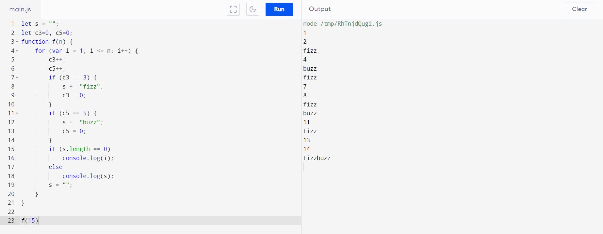
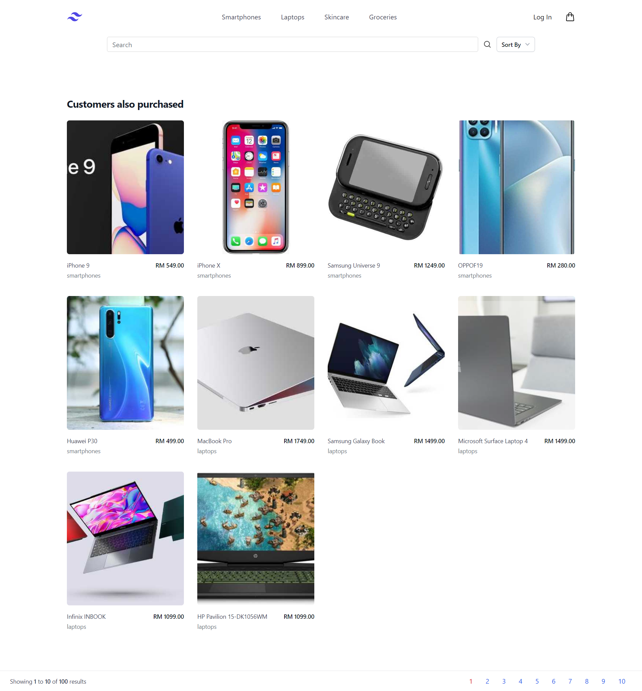
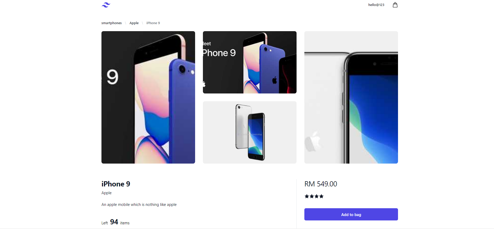
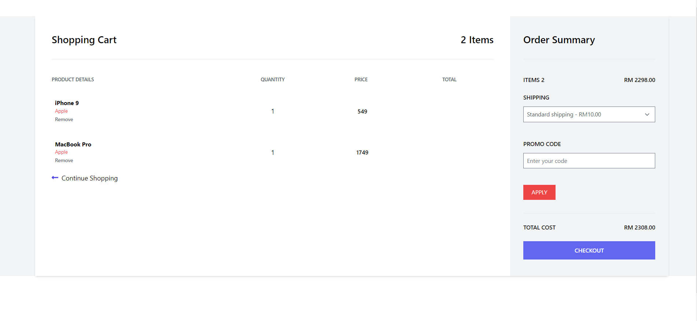
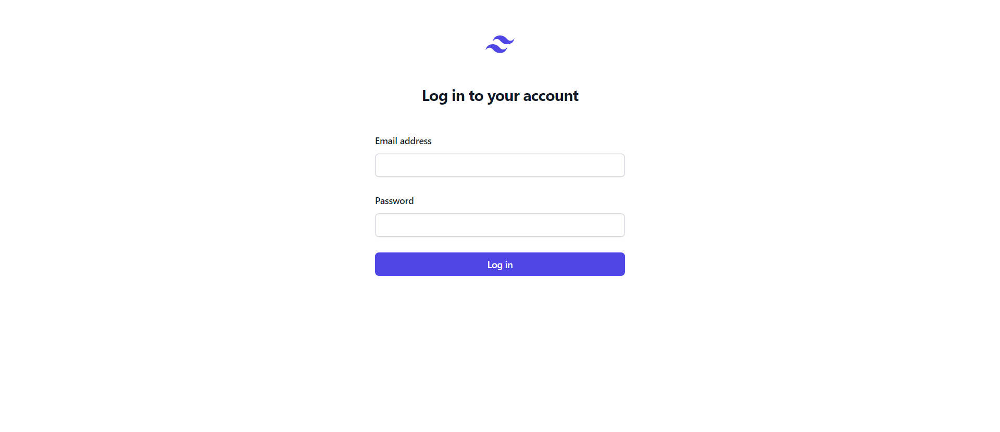

# FrontEndEngineer Test

# Q1 
- A function that loops through a N number, whereby the function should print “Fizz”, print "Buzz" for the mutiple of 5, and lastly print “FizzBuzz” for multiples of three and five.

# Q1 ScreenShots:

- Q1 Output 

# Q2
- Develop an ecommerce website using ReactJS that have the features:
  - Implement a feature where user are require to login and embded the authorization token in the header.
  - Develop a page that displays a list of products, including their name, price, image, category, etc.
  - One page should display at most 10 product only.
  - The page should allow users to search for products by name, category, and sort the products by price or relevance.
  - Develop a feature that allows users to view the details of a single product, including its name, price, image, description.
  - Develop a feature that allows users to add products to their shopping cart, view their cart(Without
checkout function).
- Packages being used:
  - React Router - To navigate user across diffrent pages of Home page
  - Tailwind CSS - To maintain centraalised state across all the pages
  - HeroIcons - Icons like cart, login, register etc

# Project SetUp Q2:
- Project Created using npx-create-react-app
- npm i to install all the required pakages
- npm start to start development server 

# Q2 ScreenShots:

- Home Page

- Product Info 

- Cart Page

- Login Page

